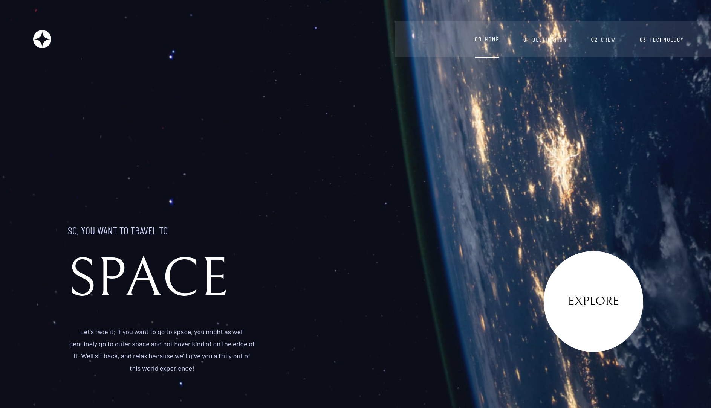

# Frontend Mentor - Space tourism website solution

This is a solution to the [Space tourism website challenge on Frontend Mentor](https://www.frontendmentor.io/challenges/space-tourism-multipage-website-gRWj1URZ3).

## Table of contents

- [Overview](#overview)
  - [The challenge](#the-challenge)
  - [Screenshot](#screenshot)
  - [Links](#links)
- [My process](#my-process)
  - [Built with](#built-with)
- [Author](#author)
- [Acknowledgments](#acknowledgments)

## Overview

### The challenge

Users should be able to:

- View the optimal layout for each of the website's pages depending on their device's screen size
- See hover states for all interactive elements on the page
- View each page and be able to toggle between the tabs to see new information

### Screenshot

### Links

- [Live Site URL](https://imran94.github.io/space-tourism-website)

## My Process

### Built with

- Semantic HTML5 markup
- CSS custom properties
- CSS Animations
- Flexbox
- [Petite Vue](https://github.com/vuejs/petite-vue) - A lightweight alternative to VueJS

## Author

- Frontend Mentor - [@imran94](https://www.frontendmentor.io/profile/imran94)
